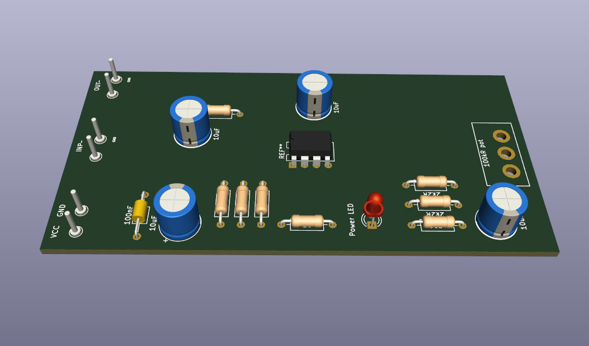
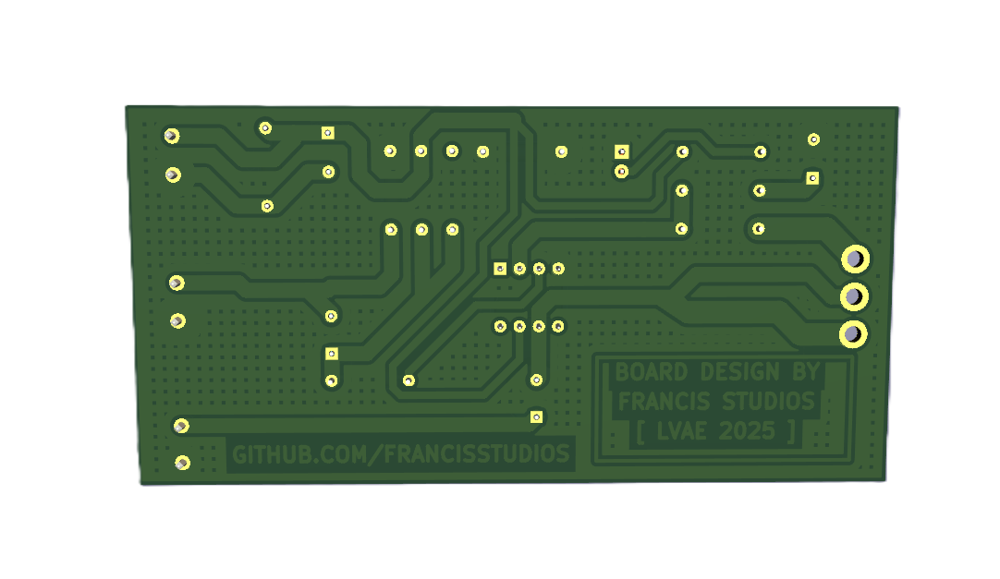
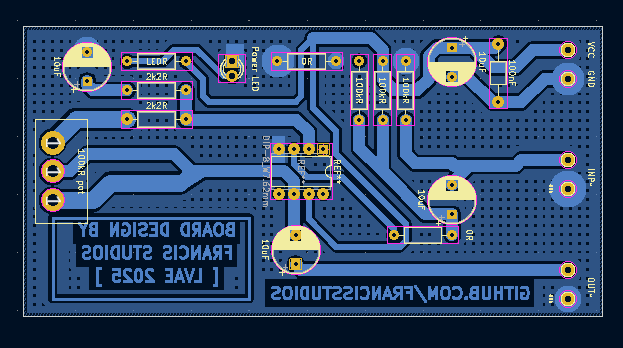
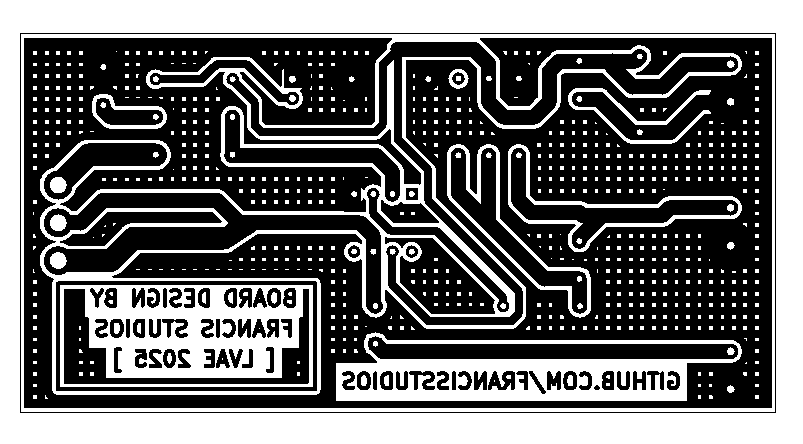
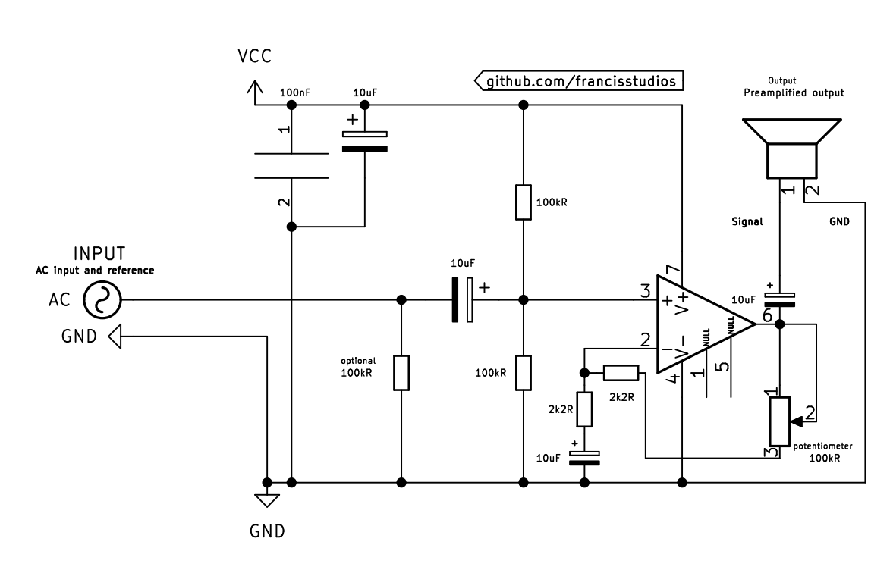

# 📻 Preamplifier with the TL071 Op-Amp

This is a simple **single-sided** PCB design (+schematic included) for the TL071 _*family_ operational amplifiers. I have used this IC in various projects over the years, and this board was born as a development tool / development instrument. 

### Instructions

This project was developed and published by `Francis Studios` in 2025

The circuit board is designed for single sided PCB manufacturing _(homemade PCB etching technologies)_ and was Open Sourced by the above mentioned project author. **Only use at your own risk and responsibility!** The repository / project owner does not take any responsibilities for injuries or broken equipment.

Operating voltages from `9VDC-16VDC` but the recommended supply is `12VDC` as it was the development environment and test supply level. 

The IC can take even higher voltages, with changing components we can archieve higher levels of power or signal levels.

`The project was designed with KiCad`

## 🤖 PCB Design

### Component mount side

### Traces and solder side

## ⚙️ Manufacturing

### CAD Look

### PCB design in  image format

This image can be transfered onto a 100mm x 50mm PCB and etched:

### 🖊️ Schematics

With this schematic you can assemble your circuit board onto a perf-board or a bread-board or whatever you prefer.

> [!NOTE]
> The schematic is adapted from [EM50205](http://www.elmodules.hu/products/40) from ELModules, so I don't claim it as my own - my contribution is rather the _nice_ PCB and the *pretty* schematical layout that can help others learn or manufacture their own simple circuitboards.
>
> Credit: [elmodules.hu](http://www.elmodules.hu/) - I recommend purchasing their models as they are great for development purposes and also great educational value

The component values doesn't have to be exact in each case but in the ballpark of these:

